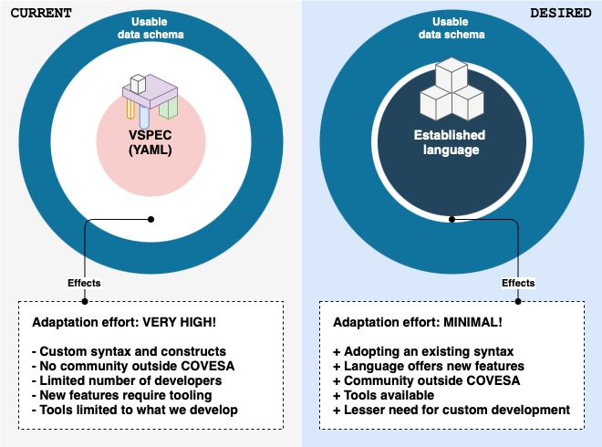
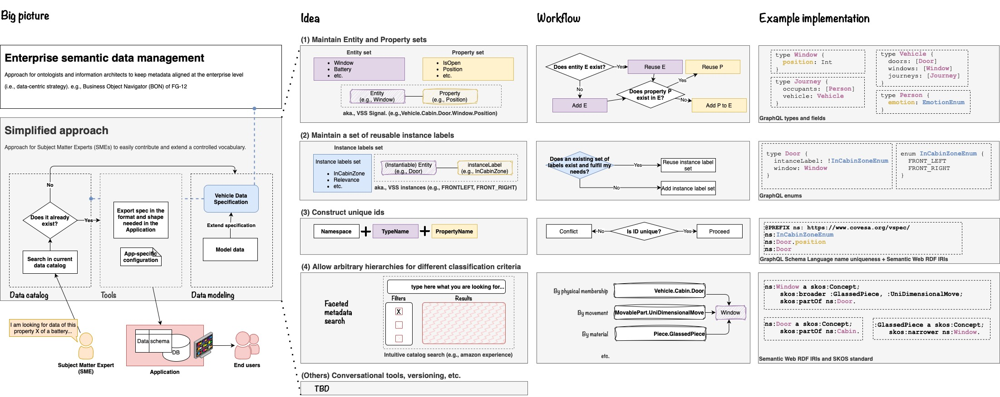

# Simplified Semantic Data Modeling (S2DM) approach primer

## Table of Contents
1. [Background](#background)
    1. [Why do we need such an approach?](#why-do-we-need-such-an-approach)
        1. [Subject Matter Experts are often NOT data modeling experts](#subject-matter-experts-are-often-not-data-modeling-experts)
        2. [Vehicle Signal Specification has been an alternative but requires improvements](#vehicle-signal-specification-has-been-an-alternative-but-requires-improvements)
    2. [Design principles](#design-principles)
        1. [Problem](#problem)
        2. [Requirements](#requirements)
        3. [Goal](#goal)
        4. [Artifact](#artifact)
2. [Proposed solution approach](#proposed-solution-approach)
    1. [General workflow](#general-workflow)
    2. [Idea (1): Maintain Entity and Property sets](#idea-1-maintain-entity-and-property-sets)
    3. [Idea (2): Maintain a set of reusable labels](#idea-2-maintain-a-set-of-reusable-labels)
    4. [Idea (3): Construct unique IDs](#idea-3-construct-unique-ids)
    5. [Idea (4): Allow arbitrary hierarchies for different classification criteria](#idea-4-allow-arbitrary-hierarchies-for-different-classification-criteria)
    6. [Other ideas](#other-ideas)
3. [Examples](#examples)
4. [Special considerations](#special-considerations)
    1. [Special cross references](#special-cross-references)
    2. [Model versioning](#model-versioning)

## Background
### Why do we need such an approach?
#### Subject Matter Experts are often NOT data modeling experts
Subject Matter Experts (SMEs) are often not familiar with data modeling, nor are they following best practices to formalize their knowledge.
This lack in expertise can be problematic when they are in charge of expanding and maintaining a certain controlled vocabulary that will be used in real systems at the enterprise level.

#### Vehicle Signal Specification has been an alternative but requires improvements
When it comes to vehicle data, the Vehicle Signal Specification (VSS) has been offering an easy-to-follow approach to enable SMEs contribute to a controlled vocabulary of high-level vehicle properties (e.g., Speed, Acceleration, etc.).

> **Vehicle Signal Specification (VSS)** is a controlled vocabulary for the properties of a car organized in a hierarchical tree. To learn more about VSS, please visit the [official documentation page](https://covesa.github.io/vehicle_signal_specification/).

The VSS modeling approach has been well received by SMEs who have been extending the list of properties both publicly at the COVESA alliance and internally at BMW.
However, this approach has reached its limits on what one can express with it.
Among the limitations, is the fact that VSS uses a custom file extension `.vspec` that referes to files written in `YAML` with a custom syntax.
The language used in `vspec`, as of December 2024, does not support cross references.
Thus, it is not possible to model multiple inter-connected domains.

> If you want to learn more about the current limitations of `VSS`, please visit these resources:
> * [Defining the COVESA data modeling strategy and its associated artifacts](https://wiki.covesa.global/display/WIK4/Defining+the+COVESA+data+modeling+strategy+and+its+associated+artifacts)
> * [Towards a Vehicle DATA specification](https://wiki.covesa.global/download/attachments/98271360/COVESA_Towards%20vehicle%20DATA%20specification_AMM_04.2024.pdf?version=1&modificationDate=1714758174348&api=v2)
> * [Vehicle DATA Specification](https://wiki.covesa.global/display/WIK4/Vehicle+DATA+Specification)

The reference mapping between the Vehicle Signal Specification (VSS) and this S2DM approach is documeted in `/docs/s2dm_vss_mapping.md`.


### Design principles

#### Problem
- Disparate vehicle data models that lack proper semantics.
#### Requirements
| **Criteria** | **Requirement** |
|----------------------|-----------------|
| **Simplicity** | Modeling approach is easy to follow. Its representation is not verbose. It is friendly for anyone new to the area. It is easy to add new concepts. |
| **Technology agnosticism** | Data model can be used with any downstream technology (e.g., by exporting it into multiple schemas). |
| **Modularity** | Data model can be split into multiple (reusable) small pieces. |
| **Scalability & Maintainability** | Model can scale up (e.g., concepts are extended). It can be easily maintained (e.g., changes and extensions are possible). |
| **Metadata resource uniqueness** | Concepts in the data model are uniquely identifiable with future-proof ids (e.g., by the use of International Resource Identifiers (IRIs)). |
| **Support for multiple classification schemes** | Polyhierarchies are supported to classify the terms in the vocabulary with different classification criteria (i.e., useful for data catalogs). |
| **Support for cross-domain references** | Multiple cross-referenced domains are supported natively by the language (useful for contextual data). |
| **Community & Tools** | Data model can be used in multiple up-to-date public tools. Modeling approach is based on a language that is already established in the open community. |


#### Goal
- To minimize the effort needed to develop, extend, and maintain vehicle-related semantic data models.

#### Artifact
- A guideline on how to model vehicle-related data with proper semantics and good practices.


## Proposed solution approach

### General workflow
A simplified approach (see figure's left side) could be the adequate bridge between the ideal enterprise metadata management and the actual use of a domain data model in an application.
Specially in cases where SMEs are actively extending a set of data structures that are needed in practice.
Also, when alliances or consortiums consist of multiple external stakeholders.

Overall, a SME should be able to intuitively search and find the data of interest via a data catalog.
If the desired data is found, tools must allow the export of it into the structure needed in the application.
In the case that no existing data matches his needs, simple steps must allow the modeling of the missing concepts.
To that end, such a process is proposed with the following ideas:




### Idea (1): Maintain Entity and Property sets
In an application, most of the value is centered around what one can read or write.
Thus, the most granular structure corresponds always to a certain `Property` (aka., characteristic, attribute, etc.). For example: the `position` of the window, the `speed` of a vehicle, the `angle` of the steering wheel.
All of them are assotiated to a particular datatype, such as `Integer`, `String`, etc.
Then actual values of those properties can have dynamic (i.e., data streams) or static behavior.

Properties belong to some `Entity` that is of interest for our application. For example:
`Window`, `Vehicle`, `SteeringWheel`, etc.
So, an `Entity` can contain a collection of properties.

The principal idea here is to maintain a set of entities and their assotiated properties.

### Idea (2): Maintain a set of reusabel labels
In some cases, there are entities that can have multiple instances.
For example, A vehicle might not have one but multiple `doors`, `windows`, `seats`, `batteries`, `tires`, etc.
Hence, it becomes useful to avoid repetition in the modeling by allowing the specification of reusable labels.
A list of labels, such as `InCabinZone`, could contain the options `FRONT_LEFT`, and `FRONT_RIGHT`.
These could be used directly to specify a particular `Door`, `Windows`, and `Seat`.

### Idea (3): Construct unique IDs
To foster reusability and avoid naming conflicts, a rule set must be enforced.
The minimum constraints must be:
- A `namespace` (`ns`) must be unique and future-proof.
- Within a `namespace` (`ns`), the name of an `Entity` must be unique.
- Within a `namespace` (`ns`), the name of an `Enum` must be unique.
- Within an `Entity`, the name of a `Property` must be unique.

In the case of `GraphQL` schema language these constraints are supported.
One can concatenate the elements to create International Resource Identifiers (IRIs)
```Turtle
PREFIX ns: <mynamespacehere>
ns:Door
ns:Door.position
ns:Door.isOpen
```

Then, IRIs can be used when defining the schema in the application.
For example, a `json` schema could look like:
```json
{
  "type": "object",
  "properties": {
    "door": {
      "implementedConcept": "ns:Door",
      "type": "object",
      "properties": {
        "position": {"type": "int"},
        "isOpen": {"type": "boolean"}
      },
    }
  },
}
```


### Idea (4): Allow arbitrary hierarchies for different classification criteria
As the `Entity` and `Property` sets grow over time, proper information classification becomes essential.
The most tangible value of this organization is visible in any online shop.
There, a faceted search is the default tool for filtering the available data with specific criteria.
The same principle can be applied here.

For example, the `Window` entity can be classified by its physical position (`Vehicle.Cabin.Door.Window`), its principle of movement (`MovablePart.UniDimensionalMove.Window`), its material (`Piece.GlassedPiece.Window`), and by other criteria.

The [Simple Knowledge Organization System (SKOS)](https://www.w3.org/2004/02/skos/) is a well-established standard to achieve such classifications.

### Idea (5): Specify possible interactions
The entity and property sets (of idea (1)) can be complemented with an specification of the set of possible operations on them (i.e., interactions or actions).
For example:

| **Domain** | **Operation** |
|-----------------|-----------------|
| `Seat`          | Get the position of all seats. |
| `Seat`         | Save a seat position to memory. |
| `Seat`          | Control the heating mode of a seat. |
| `Climate`        | Turn on/off the AC. |
| `Climate`         | Set the temperature. |
| `Climate`          | Get the fan speed per zone. |


### Other ideas:
> TODO: Conversational tools, versioning, etc.


## Examples
Refer to the [examples folder](/examples/).

## Special considerations

### Special cross references
GraphQL schema language excels in defining the structure of data models in a clear and understandable way. It provides robust elements such as types, fields within types, nested objects, and enumerations.
These features allow for a well-organized and precise representation of data structures.
However, it has limitations such as restricted cross-references, where linking fields to other fields directly is not possible.

Let us assume our model has the concepts `Window.position`, `AC.temperature`, `AC.isOn`, `Sunroof.position`.
In the `GraphQL` schema language, it is not possible to say that the `Person.perceivedTemperature` can be modified by acting on these properties.
```graphql
type Person {
  perceivedTemperature: Int
}
```
However, the following is possible and supported by the language out of the box by using nested objects:
```graphql
type Person {
    perceivedTemperature: PerceivedTemperature
}

type PerceivedTemperature {
    temperature: Int
    modifiableBy: [perceivedTemperatureModifiersEnum]
}

enum perceivedTemperatureModifiersEnum {
    ns:Window.position
    ns:AC.temperature
    ns:AC.isOn
    ns:Sunroof.position
}
```
